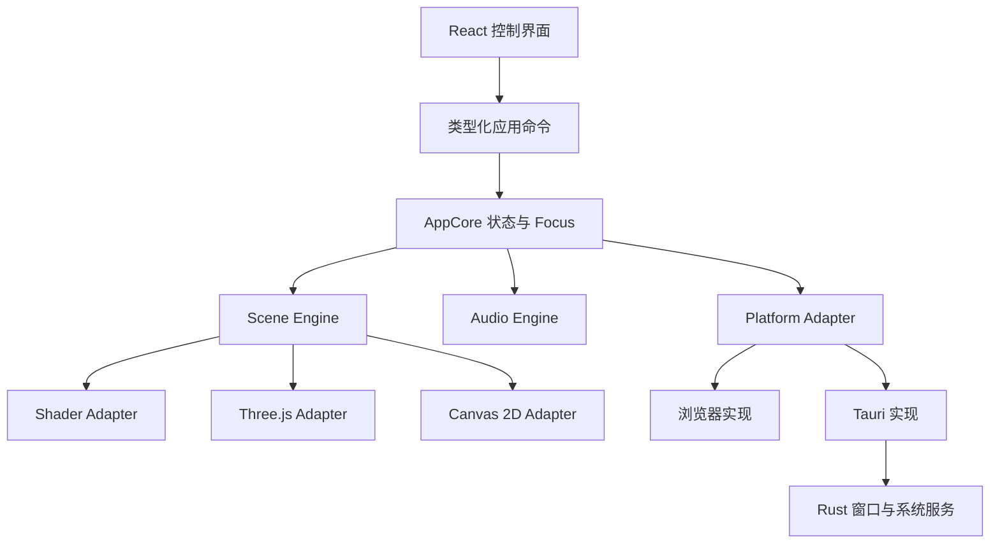
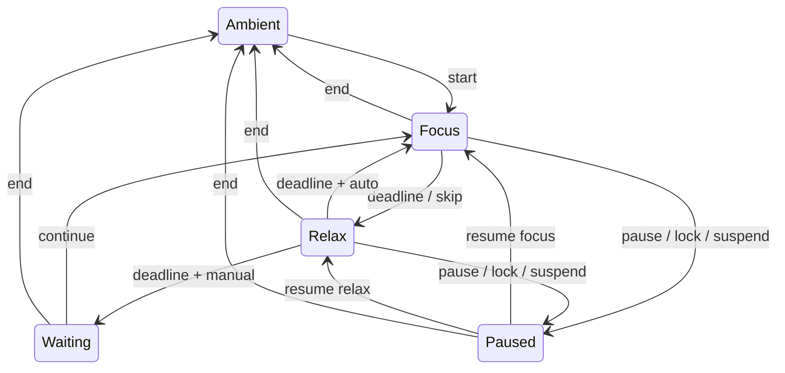

# LumaWindow 总体架构与开发设计

版本：0.3 · 日期：2026-09-17 · 状态：总体实施设计；横屏云海准备重建

## 当前实施决策

- 第一阶段只验收 A 风格横屏云海、古典蒸汽列车、约 30 分钟昼夜循环。本文的多构图接口与自动竖屏规则保留为后续产品设计，不再要求本轮实现新竖版。
- 保留 SceneEngine、React/Vite、Tauri 与平台边界；重写云海造型、天空、列车、世界构图规则和光照。优先验证 Three.js 分层 2.5D；它属于 Three.js Scene，不引入第四种创作入口。
- 场景新增独立 day-cycle 与统一 LightingState，云、山、桥、列车、蒸汽共用受光数据。昼夜读取有效活动时间，不从旅行距离推算；改变速度/画质/尺寸不重置昼夜，暂停与隐藏冻结。必须分离大步长模拟保护与昼夜活动时间累计，避免现有 delta 截断影响周期长度。
- 现有 Params/Variant 带有云海专用字段，属于原型接口，不能当成已经完成的通用创作者 SDK。改版时将场景参数与宿主生命周期职责分开，先满足一个场景，不扩展空框架。
- 旧 daylight 0–1 是单向色板位置，新循环时刻是可回绕相位，不能直接认定同义；实现时明确旧值映射/默认回退，并为自动/固定、周期和当前相位确定唯一状态所有者。画面恢复须拿到当前相位，不能在新实例内重置为默认暖霞。
- 详细任务、模块边界、保留/重做清单和验收见 [第一阶段计划 v0.3](./PHASE_1_DEVELOPMENT.md)。本次只更新设计，没有宣称上述代码已实现。

产品依据：[产品设计文档](./PRODUCT_DESIGN.md)。本文中的目录、类型和性能指标描述总体目标，不代表均已实现或已测试。具体执行顺序与验收条件见 [第一阶段开发计划](./PHASE_1_DEVELOPMENT.md)，实现状态与证据见 [阶段实测记录](./validation/PHASE_1_RESULTS.md)。

## 1. 架构目标与主要决策

| 决策 | 选择 | 原因 |
| --- | --- | --- |
| 核心语言 | TypeScript，严格类型检查 | UI、引擎与场景共享契约 |
| UI | React + Vite | 控制界面与静态网页交付，动画不依赖 React 渲染周期 |
| 桌面 | Tauri 2 + 少量 Rust | 窗口、显示器、生命周期、托盘、本地持久化 |
| 场景 | Shader / Three.js / Canvas 2D 适配器 | 支持不同创作方式，统一运行时生命周期 |
| GPU 基线 | WebGL 2，暂不依赖 WebGPU | 缩小首版兼容矩阵，启动时检测能力 |
| 包管理 | pnpm workspace | 分离核心、平台与官方场景，仍在一个仓库维护 |
| 配置校验 | TypeScript 类型 + 运行时 schema 校验 | 防止本地旧配置、贡献场景声明导致崩溃 |
| 分发 | 静态网页 + Windows/macOS 安装包 | 共享应用和场景代码，无后端服务依赖 |
| 插件模型 | 编译时登记的受审场景 | 首版不承担不可信脚本沙箱与市场维护成本 |

不在设计阶段硬编码未经验证的依赖小版本。M0 建立可运行组合，使用 lockfile 和固定 CI 工具链记录版本。Windows 开发需 Node.js、pnpm、Rust 和 Tauri 对应构建工具，按官方前置要求安装并记录实测版本。

## 2. 系统边界



依赖方向：场景依赖 scene-sdk；适配器依赖 SDK 与对应渲染库；AppCore 依赖抽象平台接口；UI 只调用应用命令。共享包不直接 import Tauri，场景不读取应用全局 store，不直接操作窗口、文件系统或网络。

所有动态场景、音频和运行时状态只有一个所有者，避免两个窗口同时渲染和播放。

## 3. 建议仓库结构

```text
LumaWindow/
  apps/
    player/                   # 共享 React 应用与 browser/desktop 入口
      src/control/            # 控制窗口 UI
      src/playback/           # 播放窗口 UI 与装配
      src/web/                # 网页同页装配
      src-tauri/              # Rust、配置、capabilities、打包
  packages/
    app-core/                 # 命令、偏好、Focus 状态机
    scene-sdk/                # 契约、参数声明、能力与错误类型
    scene-engine/             # 注册、加载、时钟、切换、质量预算
    renderer-shader/           # GLSL 与 uniform 映射
    renderer-three/            # 场景图、camera、资源辅助工具
    renderer-canvas2d/          # Canvas 绘制与 DPR 策略
    audio-engine/              # 音轨、总线、淡化、加载
    platform/                  # 抽象接口与 Web/Tauri 适配
    ui/                        # 共享控件、主题、i18n
  scenes/
    cloudsea-railway/
      manifest.ts
      shared/
      variants/side-view/
      variants/forward-view/
      assets/
      LICENSES.md
    rainlit-walk/
    starbound-drift/
    sunlit-pond/
    mistwood-cabin/
    registry.ts               # 懒加载注册表
  templates/
    shader-scene/
    three-scene/
    canvas2d-scene/
  tests/                      # 跨模块与桌面检查清单
  docs/
    PRODUCT_DESIGN.md
    ARCHITECTURE.md
  THIRD_PARTY_NOTICES.md
```

以上目录按阶段建立，不为尚不存在的功能制造空实现。原始参考视频不作为应用资源，也不默认随开源发行包发布。

## 4. Scene SDK 与构图版本

### 4.1 数据关系

SceneManifest 描述主题、作者、许可、共享参数、音频与版本列表。VariantManifest 描述渲染类型、推荐比例、版本专属参数和加载入口。Preset 保存参数和可选种子，不持有运行时对象。

场景与版本分别使用稳定 ID；显示名称可以翻译。每个场景有且只有一个基础版本。基础版本支持 9:16 至 21:9 范围，其他版本可以有推荐比例但必须处理手动选择后的不同窗口尺寸。

### 4.2 示意接口

以下代码表达契约方向，实施时补齐 schema、导出与具体泛型，不作为可直接运行的 SDK 发布。

```ts
type RendererKind = 'shader' | 'three' | 'canvas2d';
type ParamValue = number | boolean | string;
type ParamValues = Record<string, ParamValue>;

type ParamDefinition =
  | { kind: 'number'; id: string; labelKey: string;
      min: number; max: number; step: number; default: number }
  | { kind: 'boolean'; id: string; labelKey: string; default: boolean }
  | { kind: 'color'; id: string; labelKey: string; default: string }
  | { kind: 'select'; id: string; labelKey: string;
      options: readonly string[]; default: string };

interface Viewport {
  cssWidth: number;
  cssHeight: number;
  pixelWidth: number;
  pixelHeight: number;
  devicePixelRatio: number;
  aspect: number;
  // 0..1 的归一化矩形，用于休息文字避让
  overlaySafeArea: { x: number; y: number; width: number; height: number };
}

interface SceneManifest {
  id: string;
  version: string;
  sdkVersion: 1;
  nameKey: string;
  author: string;
  codeLicense: string;
  assetNotices: string;
  preview: string;
  baseVariantId: string;
  sharedParams: readonly ParamDefinition[];
  variants: readonly VariantManifest[];
  audioProfileId?: string;
}

interface VariantManifest {
  id: string;
  renderer: RendererKind;
  nameKey: string;
  preferredAspect: { min: number; max: number };
  params: readonly ParamDefinition[];
  load: () => Promise<SceneModule>;
}

interface FrameContext {
  elapsedSeconds: number; // 场景活动时间，暂停时不前进
  deltaSeconds: number;   // 已限制的大步长
  focus: {
    phase: 'ambient' | 'focus' | 'relax' | 'waiting';
    relaxBlend: number;   // 0..1，由宿主平滑驱动
  };
  reducedMotion: boolean;
}

interface SceneInstance {
  resize(viewport: Viewport): void;
  setParams(values: Readonly<ParamValues>): void;
  update(frame: FrameContext): void;
  render(): void;
  dispose(): void | Promise<void>;
}

interface SceneModule {
  create(context: SceneCreateContext): Promise<SceneInstance>;
}
```

SceneCreateContext 由宿主提供 canvas、viewport、seed、起始场景活动时间、已校验参数、质量预算、带取消信号的资源加载器和 AbortSignal。渲染实例拥有其内部资源，宿主拥有 canvas、调度器和参数状态。

SDK v1 中 update/render 每帧同步执行，异步加载仅在 create 或受管理的资源任务中进行。高质量变化若需重建资源，走宿主重新载入流程，不在 render 内 await。

### 4.3 参数与预设

- 基础面板根据声明自动生成，无需作者重复写 UI。
- 共享参数和版本参数命名不能冲突，宿主在注册时校验。
- 输入校验包括有限数字、范围、步长、颜色格式、枚举成员和未知字段处理。
- 每场景保存共享参数，每版本分别保存专属参数，切换版本不覆盖另一版本配置。
- 连续参数由场景平滑追随目标值；颜色使用合理色彩插值，避免瞬间跳变。
- 场景版本更新提供迁移函数；迁移失败时保留旧记录副本并恢复默认。
- 种子更新触发新实例的柔和切换；调参和 resize 不更新种子。

## 5. 构图选择与切换

### 5.1 自动选择初始规则

以播放窗口 CSS 宽度／高度为准，与显示器标称方向无关：

- aspect ≤ 0.85：优先竖向专属版本。
- aspect ≥ 1.15：优先横向专属版本。
- 中间区间：保持当前版本；首次载入使用基础版本。
- 没有符合方向的专属版本：基础版本。
- resize 稳定 600 ms 后才允许跨版本切换；当前版本始终先响应 resize。
- 手动选择绕过自动决策，只进行该版本内部响应式适配。

0.85、1.15、600 ms 是待体验验证的初值，可调整但必须形成单一配置，不能散落在各场景中。

### 5.2 切换事务

1. 校验目标 manifest、参数与能力，保留当前状态快照。
2. 分配递增请求号并取消旧加载任务；最新请求才可成为活动实例。
3. 在预算内预取资源，当前画面继续运行。
4. 以约 300–500 ms 淡入低亮遮罩，停止旧实例调度并释放 GPU 资源。
5. 创建新实例，应用尺寸、共享活动时间、参数、Focus blend；首帧成功后淡出遮罩。
6. 超时或失败时显示可操作错误，可重新载入旧版本或切到 Canvas 基础场景。

首版不要求两个重场景同时实时渲染交叉淡化，避免瞬时 GPU／内存翻倍。快速连续切换时，过期实例即使迟到完成也必须立即释放。加载取消、失败和 dispose 都需幂等处理。

## 6. 三种渲染入口

### 6.1 Shader Adapter

- 以 Three.js 全屏平面和 ShaderMaterial 为首选承载，统一基础渲染配置。
- 宿主映射 resolution、时间、种子、参数、Focus blend 等 uniform。
- 像素坐标转世界坐标时保持比例，不能直接用未修正的 UV 拉伸云或星球。
- 编译失败返回结构化错误，用户看到回退入口，开发模式保留 shader 日志。
- v1 控制多通道和后处理复杂度；需要复杂 3D 场景图时选择 Three.js 入口。

### 6.2 Three.js Adapter

- 创建 renderer、scene、camera；公共工具处理颜色空间、尺寸、阴影／后处理预算。
- 作者拥有场景图和镜头构图逻辑，相机 aspect 更新不等于构图适配完成。
- 使用分块生成、实例化、对象池、雾和距离裁剪控制成本。
- 场景退出释放 geometry、material、texture、render target 与监听器；共享缓存使用引用计数。
- 三种入口共享生命周期，不强制它们持有同一个 renderer 对象。

Three.js 资源需显式释放，不能仅依赖 JavaScript 垃圾回收。[官方资源清理说明](https://threejs.org/manual/en/how-to-dispose-of-objects.html)

### 6.3 Canvas 2D Adapter

- 宿主管理 backing store、DPR 与 resize，作者在逻辑坐标中绘制。
- resize 后恢复 transform 和绘制状态，避免累计 scale。
- 限制对象、粒子和离屏画布数量，静态细节可以缓存。
- 首版不强制 OffscreenCanvas／Worker；发现主线程瓶颈后再有依据地引入。

### 6.4 程序化世界

按 seed + chunkIndex 派生稳定随机值，避免不同加载顺序改变世界。保留视野前后有限分块，通过对象池回收。场景活动时间独立于真实墙钟；暂停后继续不会突然推进到数小时前的位置。

长时间运行采用局部时间、分段坐标或原点重定位，避免 float 精度下降。每个场景规定对象上限、分块上限和缓存预算；禁止只生成不回收。

## 7. AppCore、窗口与状态同步

### 7.1 所有权

**网页：** 单页持有 AppCore、Scene Engine 和 Audio Engine。

**桌面：** 播放窗口持有唯一 AppCore、场景与音频实例；控制窗口是客户端，只展示快照并发送命令。播放窗口可先隐藏创建，直到用户开始播放。

Rust 负责窗口和系统事件桥接、偏好写入、生命周期记录及单实例管理，不重复实现一套 Focus 业务状态机。播放窗口关闭前完成暂停快照和资源释放；系统强制结束通过最近检查点恢复。

### 7.2 命令协议

- 命令封套包含 sessionId、requestId、命令类型与 payload。
- 状态快照包含 sessionId、revision、当前场景／版本、偏好、Focus、声音状态、播放状态及错误。
- 控制窗口发起 ready 后主动请求完整快照；订阅事件后仍能通过快照弥补漏事件。
- AppCore 串行处理命令并校验输入；requestId 去重，已过期 session 的事件丢弃。
- 拖动滑杆可节流发送，但松手必须提交最终值；持久化另做防抖。
- 播放窗口重新创建产生新 sessionId，控制窗口重新握手。
- 不通过跨窗口事件传输每帧数据；计时显示低频同步，画面由本地帧上下文驱动。

拟定命令：selectScene、selectVariant、setParams、regenerate、setAudio、startFocus、pauseFocus、resumeFocus、skipPhase、endFocus、setPlaybackPaused。

### 7.3 显示器与窗口

平台接口提供 listDisplays、openPlayback、movePlayback、setFullscreen、exitFullscreen、subscribeSystemLifecycle 和 subscribeDisplayChanges。浏览器不具备的能力返回 unsupported，UI 使用明确的能力标记隐藏或替代操作。

桌面显示器匹配结合可用标识、名称、尺寸和上次位置；不能把屏幕索引当作永久 ID。移动窗口时正确区分物理像素与逻辑尺寸，覆盖 100%／150%／200% 缩放组合。

拔屏后重新枚举并将不可见窗口恢复到当前可用屏幕内，退出全屏。若上层 Tauri 事件覆盖不足，由小范围 Rust 与对应 Windows/macOS 系统适配实现；M1 必须验证，不假定浏览器 visibilitychange 等同于系统锁屏。

Tauri 的 Windows WebView 基于 WebView2，运行时由设备环境决定；需分别验证浏览器与桌面表现。[Tauri WebView 说明](https://v2.tauri.app/reference/webview-versions/)

### 7.4 macOS 从首版纳入

- macOS 使用 WKWebView；共享 TS 引擎和场景，系统行为通过独立适配器实现。Shader 精度、扩展、纹理能力与音频解锁均需检测，不能假定与 Chromium 完全一致。
- M0 即建立 macOS 构建任务和云海实机烟测，不等五场景完成后才移植。当前 Windows 工作区能编写共享代码，但不能据此宣称完成 macOS 构建和实测。
- 在 Mac 或 macOS CI 运行器构建 .app／DMG；分别规划 aarch64 与 x86_64 产物，是否合并 universal 在发布时根据体积与验证覆盖决定。
- Retina 只增加 UI 清晰度，场景仍受内部像素上限约束；双屏位置与缩放通过平台 API 转换。
- macOS 原生全屏可能涉及 Spaces。验证主屏焦点、副屏播放和空间切换，不要求机械复制 Windows 全屏实现。
- 菜单栏／Dock、关闭窗口与退出应用按平台习惯呈现，但暂停、持久化、静音等业务语义保持一致；提供明确 Quit 动作。
- 原生生命周期桥接按平台实现；隐藏／失焦不等于睡眠，也不能因为播放窗口未获焦就停止副屏动画。
- 正式下载渠道规划 Developer ID 签名、公证和安装验证，凭据仅存在 CI secret；没有 Mac 实机时，将能完成的构建检查与尚未完成的画面／功耗验收分别报告。

官方依据：[WebView 差异](https://v2.tauri.app/reference/webview-versions/)、[macOS 打包](https://v2.tauri.app/distribute/macos-application-bundle/)、[签名与公证](https://tauri.app/distribute/sign/macos/)。

## 8. Focus 状态机与时间



Paused 保存原阶段和 remainingMs。Ambient 不存在活动计时器。配置改动只影响下一阶段。skip Relax 视为用户主动继续，进入 Focus；自然休息结束才依 autoNext 决定进入 Focus 或 Waiting。

### 8.1 三个时间源

1. sceneTime：活动画面的时间，暂停渲染时冻结。
2. focusTime：专注逻辑时间，不能通过累计渲染帧 delta 计算。
3. audioTime：AudioContext 时间，用于精确淡化，与 UI 更新频率无关。

同一运行会话内 Focus 使用可注入的单调时钟和绝对截止时间计算剩余值；同时保存墙钟检查点用于重启恢复和系统异常识别。恢复不得直接相信旧 performance.now 数值。

定时任务只触发 reconcile，不能用 setInterval 每秒减一。网页后台可能暂停 requestAnimationFrame，因此返回可见状态必须重新对账。[MDN requestAnimationFrame](https://developer.mozilla.org/en-US/docs/Web/API/Window/requestAnimationFrame)

### 8.2 恢复规则

- 正常可见：阶段到期开始下一阶段。
- 网页长时间后台：恢复时若已到期，最多进入一个下一阶段，从当前时刻重新计时，不补跑多个周期。
- 桌面锁屏／睡眠：系统事件携带发生时刻，计算该时刻剩余值后暂停，并落盘；恢复不自动启动。
- 最小化不暂停 Focus，恢复时 reconcile；不能靠持续 GPU 渲染维持计时。
- 异常退出：最近检查点恢复为 Paused，最多损失一个检查点间隔，不声称完全精确。
- 检测显著墙钟／单调时钟偏差时进入暂停待继续；通过注入时钟测试睡眠和改时钟。

休息视觉 blend 用平滑插值从当前值过渡到目标值，默认 15 秒；快速跳过或结束从当前 blend 接续，不闪回端点。

## 9. Audio Engine

播放窗口拥有唯一 AudioContext。总线建议：环境音、音乐、可选提醒 → 各自 gain → master gain → 输出；各阶段层级再由平滑包络混合。

- 只有用户手势解锁／resume 成功后才标记 audible；UI 分清“偏好已开启”和“实际正在播放”。
- 若控制窗口手势无法解锁播放窗口音频，在播放窗口提供一次“点击开启声音”，不可显示虚假的播放状态。
- 默认启动静音；加载资源或恢复应用不自动制造声音。
- 短循环使用 AudioBuffer，长音乐使用媒体元素接入图；长音轨不默认完整解码到内存。
- 同步声部从同一时间位置开始，gain 在 audioTime 上调度；普通音轨使用交叉淡化。
- 切场景释放不再使用的音源和引用，主音量与用户选择保留。
- 锁屏／睡眠保存播放状态并暂停，恢复待用户继续；最小化则保留已开启音频。
- 失败只影响音频模块，视觉与 Focus 保持工作。

浏览器音频自动播放受限制，需要主动处理用户手势和 AudioContext 状态。[MDN 自动播放指南](https://developer.mozilla.org/en-US/docs/Web/Media/Guides/Autoplay)

## 10. 持久化与资源管理

### 10.1 配置

Web 使用 localStorage 保存小配置；桌面通过 Rust 原子写入应用数据目录。首版不需要数据库。

```text
schemaVersion
locale, reducedMotion, quality
lastSceneId
scenePreferences[sceneId]:
  variantSelection, sharedParams, variantParams, seed
audioPreferences
focusDefaults
focusCheckpoint
displayPreference
windowBounds
```

持久化节奏：偏好变更防抖约 500 ms；Focus 状态转换立即保存；活动会话约每 15 秒检查点；受控退出先 flush。UI 不等写盘完成才反馈，但写失败需提供轻量错误并允许重试。

加载流程：解析 → schema 校验 → 迁移 → 范围修正 → 恢复。文件损坏时保留备份并恢复默认，不导致启动崩溃。日志不保存用户文件内容或未经用户同意上传。

### 10.2 资源

- 场景通过静态 registry 动态 import，按需加载代码与素材。
- 桌面随包包含五场景所需资源；网页使用哈希资源 URL 和独立场景包。
- 共享资源缓存必须有上限、引用计数与逐出策略，统计 CPU 与 GPU 的不同资源类型。
- manifest 记录资源许可，构建检查引用是否存在，不接受“来源网络”作为许可说明。

## 11. 性能与稳定性预算

**2026-09-17 策略调整：视觉先达标，性能同步测量，预算由证据确定。** 下列数值作为初始对照配置，不是 R1/R2 美术探索的硬上限。允许显式配置、可追溯的超预算实验，记录视觉收益和资源成本；每次测量标明实际配置，不把实验值默认为日常档。最终档位须结合动态观感、低功耗设备和办公并行结果确定。2014 年 Mac 不决定视觉上限。

优化顺序：无用绘制/重复计算与资源复用 → 透明覆盖和素材存储 → 内部清晰度/远景细节/帧率。尽量保留各档主要云形、构图、色彩和昼夜；核心效果确实高成本时记录对照后再决定取舍。有界资源、释放与暂停机制仍是实现要求。

产品约束：安宁、和谐、诗意、放松优先。资源节制从算法选型开始，不能先堆叠昂贵效果再依靠降分辨率补救。

- 官方运行链路默认不启用 bloom、镜头耀斑、装饰性粒子、光轨或其他炫技后处理。
- 云雾优先尝试分层密度、有限噪声采样和简化光照；不把高步数体积光线步进作为默认实现要求。
- 自然雨滴、萤火等使用固定预算和复用机制，仅保留有构图意义的数量。
- 几何、缓存、渲染通道和纹理分辨率必须有预算；高质量档改善清晰度／采样稳定性，不添加新的装饰效果。
- 启用昂贵渲染能力前，记录开启／关闭的视觉收益、帧耗时和资源差异；收益不足则删除。
- 参考机验证同时记录主屏工作负载下的表现，并与未启动应用时对比；以对工作的实际干扰作为降级依据之一。

以下是 M0 起采用的初始工程目标，不是已测结果。候选低配基线为普通集显、8 GB RAM 的 Windows 笔记本，Apple Silicon 候选为 M1／8 GB，以上测试机尚待落实。现有开发机为 i7-12700KF／RTX 3080／32 GB，不能替代低配测试。朋友可提供 2019 年 16 英寸 MacBook Pro 和 2014 年 MacBook Pro，分别用于 Intel Mac 重点验收与旧设备边界探索，均尚未实测。

M0 需记录准确 CPU、GPU、RAM、已安装系统、WebView、屏幕、电源模式和环境条件，再冻结验收基线。2014 年机型先做工具链最低系统兼容、安装启动与 WebGL 能力检查，再测省电档；不预先宣布支持，也不要求非官方系统升级。对具备双 GPU 的测试机记录实际活动 GPU，检查场景是否导致高功耗 GPU 持续激活；不能仅以低 CPU 占用推断省电。开发机限帧／降分辨率只能验证质量策略，不能模拟旧 GPU 或旧 WebView 的兼容性。

| 项目 | 初始目标／方法 |
| --- | --- |
| 平衡档 | 30 FPS，场景内部像素预算约 1.0M，DPR 上限 1.5；GPU 与 Canvas 场景均受预算限制 |
| 省电档 | 20 FPS，内部像素预算约 0.6M，降低自然元素数量与采样成本 |
| 高质量档 | 30 FPS，内部像素预算约 2.1M；不自动提高到 60 FPS |
| 帧稳定性 | 基准机平衡档 10 分钟采样，95% 帧间隔不超过 40 ms；排除显式加载过渡 |
| 场景 CPU 工作 | update + render 提交耗时 p95 目标 ≤ 8 ms；不等同 GPU 完成时间 |
| 连续运行 | 2 小时无崩溃、长时精度抖动或对象计数持续上升 |
| 切换压力 | 50 次后资源计数回到稳态；回收稳定后内存相对预热稳态不持续增长 |
| 内存初值 | 单场景含音频，预热后总应用关联进程内存目标 200–300 MB；持续超过 400 MB 触发分析与优化。须包含 WebView 子进程，分别记录 Windows 工作集与 macOS 内存口径，不能直接跨系统等同；目标尚未实测 |
| 后台视觉 | 最小化／不可见停止渲染；Focus 和必要音频独立运行 |

像素预算与 DPR 上限同时生效，取更严格者，不能叠乘后突破预算。UI 独立以清晰逻辑尺寸绘制。质量自动降级需持续超预算窗口与冷却时间，不按单帧抖动；不自动频繁升档。

GPU 占用、功耗、温度和风扇受硬件影响大，先记录比较值，不写无硬件条件的百分比承诺。黑屏／上下文丢失时暂停渲染，尝试一次重建，持续失败则提供 Canvas 回退。

低功耗验收补充：同一设备、相同电源模式与屏幕亮度，分别测未运行、纯播放、办公负载、办公负载加播放，每种状态预热后观察至少 20 分钟，记录 CPU、GPU、内存、功耗／电池耗电和可获取的温度、风扇信息。无风扇 Mac 以温度、耗电和主屏性能判断，不能用“没有风扇噪声”代替低功耗结论。必要时降采样或简化算法；FPS 稳定但持续升温同样需要优化。

## 12. 权限与扩展边界

- Tauri capabilities 按窗口分配，控制窗口只拥有所需控制权限，场景不能直接调用本地能力。
- 使用本地可信前端资源，限制 CSP，不为任意远程页面开放 Tauri 权限。
- 场景入口在编译时登记；manifest 是元数据，不是安全沙箱。
- PR 代码审查检查网络访问、无限循环、资源释放和素材许可。
- 不默认读取任意用户目录，不提供 shell 执行给场景。
- 自动更新暂不实现；公开发布前决定签名、校验与版本升级策略。

Tauri 权限通过 capability 授予窗口或 WebView，实施时应逐项启用。[官方 Permissions](https://v2.tauri.app/security/permissions/)

## 13. 测试与验收策略

### 13.1 自动化

- Vitest：Focus 状态机和可注入时钟、参数校验、版本选择迟滞、配置迁移、命令去重。
- 引擎集成：加载取消、迟到实例 dispose、创建失败、切换回退、resize 不重置 seed/time。
- SDK 合约：三类模板均能创建、resize、update/render、重复安全释放；不以截图替代生命周期检查。
- 浏览器 E2E：场景选择、构图、参数恢复、Focus 快速测试时钟、静音／解锁、全屏回退。
- 构建：类型检查、lint、单测、网页生产构建、Rust 格式／检查和 Windows/macOS 分平台打包。

### 13.2 视觉验收

对五个场景、全部官方版本、16:9／21:9／9:16、Focus／Relax 和至少三组种子取样。验证构图、运动、过渡和长时连续性，不能只看单帧截图。

GPU 跨设备渲染可能有差异，截图测试使用容差；黄金图不能作为唯一美术判据。人工播放检查云层闪烁、轨道接缝、粒子突现、音频接缝和用户注意力负担。

### 13.3 Windows 与 macOS 实机

- 主屏横 + 副屏竖、两横屏、单屏，混合缩放与负坐标布局。
- 全屏、Esc、拖动、拔屏、睡眠、锁屏、恢复、托盘退出。
- 控制窗口重开、播放窗口关闭／重建、第二次启动应用。
- 全新配置和旧配置迁移、断网启动、资源缺失和 WebGL 不可用。
- 2 小时运行与 50 次切换，记录进程资源而非仅 JavaScript heap。
- 在无开发工具依赖的干净 Windows 与 macOS 环境分别安装发布产物。

桌面系统行为不能仅凭浏览器 E2E 通过宣布完成。

## 14. 实施顺序与完成定义

### M0：把视觉与高风险技术跑通

具体任务、依赖、交付物与验收步骤见：[第一阶段开发计划](./PHASE_1_DEVELOPMENT.md)。该文件的“第一阶段”对应本节 M0，不等同于下节 M1。

1. 建立最小 TS/Vite 工程、基础 SDK 和一个 Shader 运行入口。
2. 重建 A 风格横屏动态样板、古典蒸汽列车、昼夜光照与持续生成；竖屏延后。
3. 用最小 Tauri 外壳验证双屏定位、WebView2 渲染、音频解锁和系统生命周期事件。
4. 记录参考机性能，决定正式画质预算；调整设计后再扩展。

完成定义：横屏动态视觉获认可，30 分钟昼夜与持续生成成立，核心平台与低功耗风险有实测结论。竖屏不是本轮门槛；未实测的 Mac/低配不能算通过。

### M1：完成一个纵向功能链路

1. 完成 AppCore、Focus 状态机、持久化和平台接口。
2. 建立控制／播放窗口同步、显示器恢复、托盘与退出流程。
3. 完成云海参数、环境音与阶段混音；横屏验收后另行恢复竖屏专属设计及版本切换，不提前绑定两套美术实现。
4. 完成网页同页装配和 Windows/macOS 端到端检查。

完成定义：产品文档描述的云海选屏 → 播放 → Focus → Relax → 恢复流程成立；核心异常可恢复。

### M2：证明场景体系可扩展

1. 完成 Three.js、Canvas 2D 入口和三个最小模板。
2. 依次实现浮光水庭、雨夜归途、星海漂航、雾林小屋。
3. 使用新场景反查 SDK，只添加实际需要的公共能力。
4. 完成场景许可记录、基础预设和视觉回归矩阵。

完成定义：五场景齐备，作者不修改宿主即可注册场景，横竖屏与性能目标通过。

### M3：发布准备

1. 完成 README、中英文说明、贡献指南、许可、截图和演示录屏。
2. CI 在对应系统运行器产出网页与 Windows/macOS 安装包，验证哈希和安装流程。
3. 确认仓库归属、最终许可、托管方式和签名策略。
4. 发布网页 Demo 与 GitHub Release，收集朋友的主动反馈。

完成定义：源码可复现构建，所有发行资源有许可依据，干净环境可安装并离线播放。文档完成不等于软件交付完成。

## 15. 决策记录与待验证项

| 编号 | 决策／风险 | 处理阶段 |
| --- | --- | --- |
| ADR-001 | 一个场景家族可含多个独立构图版本，基础版本响应式兜底 | 已采纳 |
| ADR-002 | React 不驱动每帧动画，场景引擎单独调度 | 已采纳 |
| ADR-003 | 桌面播放窗口拥有唯一 AppCore 与音频，控制窗口发送命令 | M1 验证 |
| ADR-004 | 首版通过受审源码扩展，不设计远程脚本市场 | 已采纳 |
| ADR-005 | 跨重场景使用遮罩切换，避免双份实时渲染 | 已采纳 |
| R-001 | 云海斜俯视可能需要比横向更复杂的几何表现 | M0 用动态草样决定具体实现 |
| R-002 | 控制窗口手势不能可靠解锁播放窗口音频 | M0 实测，保留播放页解锁入口 |
| R-003 | 系统睡眠／锁屏桥接与时钟跨睡眠行为 | M0/M1 实测并覆盖恢复测试 |
| R-004 | Windows/macOS 支持版本、WebView 依赖与签名／公证渠道 | M1/M3 固化 |
| R-005 | 正式音乐与美术资源许可 | M2 前落实来源，M3 完整审查 |

## 16. 实施时核对的官方资料

- [Tauri prerequisites](https://v2.tauri.app/start/prerequisites/)
- [Tauri JavaScript API](https://v2.tauri.app/reference/javascript/api/)
- [Tauri WebView versions](https://v2.tauri.app/reference/webview-versions/)
- [Tauri permissions](https://v2.tauri.app/security/permissions/)
- [Three.js resource disposal](https://threejs.org/manual/en/how-to-dispose-of-objects.html)
- [MDN requestAnimationFrame](https://developer.mozilla.org/en-US/docs/Web/API/Window/requestAnimationFrame)
- [MDN autoplay guide](https://developer.mozilla.org/en-US/docs/Web/Media/Guides/Autoplay)

外部 API 细节可能变化，开始实现对应模块时以锁定版本和当时官方文档为准。本文提出的架构约束、产品行为与验收目标应作为稳定接口维护。


### 第一阶段当前参数补充（2026-09-17）

为响应用户对参数变化幅度的要求，最小实现新增 cloudShape（云层形态，0–1，默认 0.45）和 framing（取景远近，0–1，默认 0.4）。两者属于云海主题共享参数，由播放实例平滑追随；形态同时控制天空与近景，取景映射相机 FOV。与原有参数一起经过 validateParams，缺省值可兼容旧对象。本节记录当前实现，不表示视觉或跨平台验收通过。
