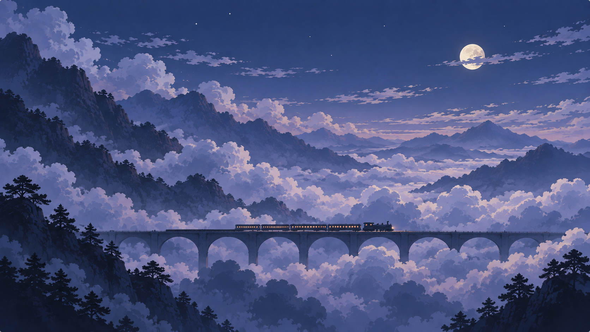

# 云海列车视觉规范：暖霞云谷与月下远山

版本：0.6 · 日期：2026-09-17 · 状态：0.2.1 云山形体的进步获用户认可，远近层次与局部受光仍未达到预期；见[第二阶段设计](PHASE_2_DESIGN.md)。下文 0.1.1 反馈保留为方向依据。

配套：[第一阶段计划](./PHASE_1_DEVELOPMENT.md) · [概念稿与提示词](./concepts/revision-02/CONCEPTS.md) · [旧参考分析](./archive/VISUAL_DIRECTION-v0.1.md)

## 1. 已确认目标

主参考为 **A 暖霞云谷**，整体采用其丰富而和谐的云层、山岛、色彩和空间关系。**C 月下远山**用于同一世界的夜景光照。B 仅保留探索记录，不混入新的默认构图标准。

列车改成古典蒸汽列车，有间歇、柔和的蒸汽。默认完整昼夜约 30 分钟。当前先完成横屏；竖屏专属与横版竖屏回退美术均延后。

概念图是美术方向，不是软件截图或低配置效果保证。“晨雾中的空中轻轨”、旧灰青主色板、旧三节现代车体不再约束新实现。

### 0.1.1 体验反馈后的方向修正

**精绘的人工结构，与程序绘制的写意自然形成对比。** 列车和桥梁承担准确比例、清楚结构和有选择的细节；云、天、山承担大面积色块、晕染、泼洒感和夸张的形态变化。自然景物不以写实纹理密度为美术目标，也不把概念图中每一处云的细节都复制到程序里。

0.1.1 可作为工程与渲染路线试验的阶段成果，不能标记核心视觉验收通过。当前四种云轮廓、三种山轮廓的图集重排/缩放/染色，以及固定在屏幕两侧的前景山，均不满足这次确认的目标。自然景物的主生成路径需替换，不靠增加几张同类轮廓图集完成纠偏。

## 2. 构图与造型

- 辽阔云谷是主角，列车需要更纤细、更长、更远。分别控制车身高度、单节车长与编组数量，不能只把现有短列车整体缩小。下一轮可先试 8–12 节客车、车身高度约画高 1–2%、编组总长约画宽 24–32%，这些仅是待画面对照的起点。
- 大云墙、中层云团、低平云海共同组成体积；采用程序生成的大中小轮廓和大色面，允许超现实的尺度、曲线和冷暖分布。避免重复棉花球、满屏细噪声及写实纹理的均匀堆砌。
- 深色近山与松树剪影、半隐的中景山岛、淡色远山形成空气透视。避免大片灰雾把层次洗掉。
- 受光面有奶油金、杏色与珊瑚色，阴影有紫灰、蓝紫与冷青；安宁不等于低饱和灰蒙。
- 高光集中在受光边缘，不给每朵云描一圈同样亮的边。不使用发光粒子、泛光、镜头耀斑和光束。
- 桥梁纤细，拱洞与云雾有遮挡关系；避免厚重桥面和夸张近景透视抢占画面。
- 铁路和列车严格水平侧向前进；默认桥面没有斜坡，镜头不滚转，不使用斜向纵深构图。前中远景视差提供行进感，不使用明显摇晃或频繁推拉。

## 3. 古典蒸汽列车

**第二阶段补充：** 用户指出 0.1.3 列车有玩具感和运煤车联想，列车造型尚未通过。明确为“古典长途客运蒸汽列车”，重做单节长高比、机车轮廓、窗列与材质主次、拖曳蒸汽；保留远眺与水平构图。详见[列车造型对照与设计](TRAIN_VISUAL_DESIGN.md)。不能以继续增加车厢数量或机械细节代替这次修正。

- 一台有烟囱、锅炉、驾驶室和可辨车轮轮廓的机车，煤水车及较长客车编组。
- 深墨绿/近黑车体、少量金属细节、柔暖车窗；没有霓虹边缘和大灯光晕。
- 机车和客车精绘结构：锅炉与驾驶室比例、车顶、车窗节奏、车轮与连杆、车厢连接应可信，避免方盒图标感。细节按远景实际显示尺度取舍；精绘不等于强高光或高多边形数。
- 桥梁同样精绘：纤薄桥面、栏杆、拱券厚度、桥墩收分、克制的石材/接缝与光影；允许制作和复用精细结构模块，保持桥跨连续。
- 蒸汽偶尔从烟囱升起，缓缓后飘、扩散并消失。亮度、阴影和色温随同一场景光照变化。
- 画面中的蒸汽用于表达慢旅程，不是逼真的锅炉/烟气模拟；低对比、数量有界、无随机闪烁。

## 4. 昼夜美术

| 时段 | 主要视觉关系 |
| --- | --- |
| 黎明 | 低处暖光逐渐染亮云缘，天空保持冷色 |
| 白天 | 蓝天、米白云顶、带色阴影，保持层次，避免过曝白块 |
| 暖霞 | A 的杏金/珊瑚与紫灰对照，作为默认起始氛围 |
| 蓝调 | 暖色逐渐集中到地平线与车窗，山与云仍可分辨 |
| 月夜 | C 的靛蓝、银紫与少量暖窗；月亮克制，云海并非整体压黑 |

太阳、月亮、天空、云影、山体、桥梁、列车与蒸汽响应同一光照状态；不切换独立背景，不在夜景出现时重置世界。日月位置与光向协调，避免昼夜交界物体突然变亮或闪现。少量稳定星点可选，不做闪烁星雨。

先在三个固定时段验证同一套造型的可读性，再完成连续周期。光照不仅改变色相，还应改变受光关系、远近对比和车窗相对亮度。无需以昂贵物理渲染实现。

## 5. 持续变化

- 变化来自空间结构：厚云墙逐渐退去、山岛出现、桥梁穿过云隙、开阔云海展开。
- 每个区段有主形和留白规则；使用 seed + 区段索引保证可重现，有界加载和回收。
- 新区段在画外准备，通过连续行进进入，不用淡入整幅新背景代替旅行。
- 云、天、山的主要轮廓、内部色面和疏密结构由程序持续生成；不能以固定几种完整自然物轮廓的拉伸、缩放、换色或重排代替。允许复用绘画规则、基础笔触算法和缓存，不允许用有限的完整山/云模板作为主形态来源。
- 生成先决定构图与大轮廓，再形成中尺度起伏、色面和少量边缘肌理。单纯增加随机噪声或逐帧随机重画不能作为质量方案。
- 新区段可在画外由程序绘制并缓存，进入画面后稳定存在，按旅程回收；相邻区段共享连续的世界坐标与边界条件。程序生成不要求每帧重算整个画面。
- 日夜变化和旅行距离独立，停车仍可以欣赏天色缓慢改变。
- 参数两端产生清楚的整体变化，过渡仍缓慢、连续且可看。

### 镜头、视差与遮挡

- 观看设定：观众坐在一列行进的火车上，看向远处另一列大致同向同速行驶的列车。远处列车在画面中相对稳定，静止地景向相反方向退去。
- 所有地景依附世界坐标，通过同一个镜头行进距离投影；近景移动快，中景次之，远山慢。可以采用风格化 2.5D 深度，但必须保持一致的空间关系。
- 前景山、树影、云团要真实进入、掠过、离开画面，禁止屏幕两侧固定摆件或正弦往复代替旅程位移。云层可另外叠加缓慢风移。
- 允许近山与近云间歇遮住部分桥梁和列车，随后揭开新景。不能为了让列车始终完整而取消前景，也不能长时间完全盖住列车。
- “安宁”约束的是运动是否连贯、镜头是否稳定、对比是否克制；不要求所有深度层都以相同的极慢速度移动。近景较快且局部的掠过，是旅行感的重要来源。

### 第二阶段用户补充：动态舒适、日月连续与晴天通透

- **动态舒适度是硬性要求。** 取消远眺下密集、细小、易闪动的桥栏竖条；所有桥面细线、车窗与自然物边缘都要检查移动时的稳定性。按屏幕实际尺寸简化细节，省电档不能保留引人注意的闪烁或摩尔纹。优先通过造型取舍解决，避免仅提高帧率或渲染预算。前景仍保持正确视差，不用整体减速替代修正。
- **日月具有连续、可理解的运动路径。** 由统一昼夜相位驱动升起、经过和落下/出画；允许镜头只看到路径的一部分。山云遮挡、天体位置与受光方向协调，不能用固定位置的透明度变化代替轨迹。太阳为温暖简洁盘面，月亮为较冷银白并有克制的月面明暗，在正常全景下可辨；保持无光晕、耀斑、光束。月相不在单个昼夜周期中任意轮换。
- **白天的通透感是明确验收目标。** 清澈天空、干净受光面、有色阴影、清楚的近中景和逐层退远的空气共同营造晴朗、舒展的感觉。雾应有空间选择，默认晴天不能整体灰蒙；保留可选朦胧效果。通透感不能仅靠全局提亮、加饱和或删除空气透视获得，暖霞和月夜也需保留各自的明暗主次。
- 上述要求同时检查真实动态和截图：一分钟昼夜检查轨迹与接缝，正式速度检查观看舒适度，三档画质与不同缩放检查细线稳定性。详细反馈与实现核对见 [0.2.0 视觉诊断](validation/VISUAL_AUDIT_0.2.0.md)。

### 0.2.1 反馈：距离与受光分开设计

- **近实远虚必须在静止画面中成立。** 近景具有更深的暗部、更明确的形体转折与有选择的清晰细节；中景承接主体；远景减少细碎纹理和明暗反差，颜色更淡雅、边缘更柔和。不能仅靠视差、遮挡或加大雾感建立纵深。
- **近景不等于全部压黑，远景不等于全部泛白。** 按层次设计亮面、主体与暗部的范围；高光面积、纹理尺度和冷暖变化也随距离组织。晴天保持通透，空气透视不以整屏灰罩实现。
- **光源周围应有可读的受光关系。** 光源一侧的云面和山脊更明亮，背光与遮挡处保留深色。日月按远处方向光处理，以风格化的宽幅照明区域和形体受光营造效果，不能按屏幕圆盘距离把所有物体无条件提亮；不添加光晕、光束或炫技特效。
- 景深与受光是两个独立因素：允许远处朝光云更亮、近处背光云更深，也允许近云局部亮边。避免共用一套高光把前后层次重新抹平。
- 先用同一 seed、位置和时段验收静态远近关系，再测试光照变化和正常速度动态。细节层次通过减小远处高频与反差实现，不能为“近处更清晰”重新加入闪动细线。
- 详细观察、代码原因与优先级见 [0.2.1 视觉复诊](validation/VISUAL_AUDIT_0.2.1.md)。

### 0.2.1 补充：辽阔远望的构图

- 铁路采用偏下的屏幕位置，为桥后山云向远处展开留出空间；先对比画高约 70% / 75% 的构图样板，比例为实验起点。铁路高度与取景缩放分开设计，不能一拉远就将铁路推向画面中央。
- 铁路与远处开口之间应有可读的云谷、山脊、低平远云及空气间隙。天空留白、简单缩小列车或增加绘制层数都不能单独承担辽阔感。
- 正交投影下主动组织远处形体缩小、云带变薄、层间距离压缩，以及对比/细节递减。主云、近景和远山共享宏观开口约束，避免各层缺口互相堵住。
- 保持水平铁路与前景视差；通过桥脚隐入低云、局部遮挡和较弱拱边减少横向分割。旅程包含连续变化的封闭段与舒展段，开口不永久固定为对称隧道。
- 详细成因与验证方法见 [视觉复诊第 8 节](validation/VISUAL_AUDIT_0.2.1.md)。

## 6. 实现与审美验收

已确认开发策略：先让实际动态效果达到 A 的视觉目标，过程中同步记录资源开销，再优化并确定设备档位。初始性能预算可在可追溯的实验中暂时超出，不提前牺牲云形、色彩与空间层次。最终仍需低功耗实测，2014 年 Mac 不作为视觉上限。

分层 2.5D 宿主可以保留；自然景物需要验证程序轮廓/连续色场/程序笔触的生成与绘制，而非复用 0.1.1 的完整云山图集主路径。列车和桥梁可以使用精绘原创素材或精细矢量/几何结构，并保留车轮、蒸汽和昼夜着色的独立控制。无需用户现在购买模型或音乐。

不把整张概念图直接用作滚动背景；不使用原视频帧作资产。局部素材记录来源与生成/制作过程，正式发布前整理许可与署名。

验收先看实际运行的形状、冷暖、遮挡、比例与视差，再看参数与长时间变化。单元测试通过、静态图好看、RTX 3080 流畅分别只证明各自事项，不替代动态观感与低配验证。当前仅 A/C 概念方向获得认可，旧程序画面没有因此通过。

下一轮先交付一个 60–90 秒的真实横屏动态样板：更细长的精绘列车与水平桥轨、写意程序景物、近景掠过与遮挡。昼夜用 1 分钟开发周期快速验证；另看自然行进速度，不能用旅行快进掩盖节奏。先通过视觉反馈，再扩展区段种类和其他产品功能。
