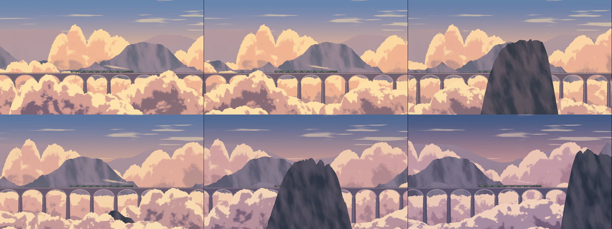
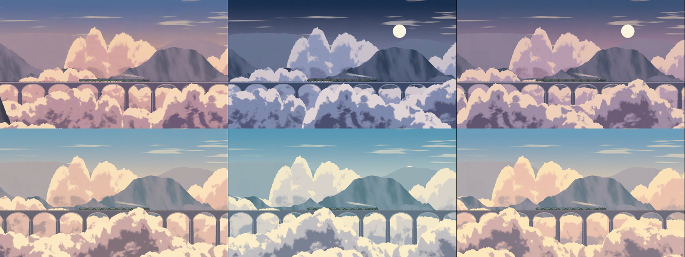

# 第二阶段测试版移交 · 0.2.0

日期：2026-09-17。实现范围已完成，交给用户进行视觉与实机验收；不代表最终概念图效果或整个 M0 已获认可。

构建指纹：`39fdcfe8a43740e0`。本机交付目录：`.local/deliverables/phase2-0.2.0/`。

## 本轮完成

- **列车重绘**：八节长途客车，单节车身 68 × 13.5（约 5:1），重画弧顶、车端、窗列、转向架、驾驶室和长锅炉；低矮煤水车、收敛轮圈与机械亮边。保留远眺尺度，静态几何按七类材质合批。蒸汽从真实烟囱位置发出，向后舒展、渐隐，固定 14 个对象循环使用。
- **昼夜配色**：黎明、白天、暖霞、蓝调、月夜九个连续色彩节点；云亮面/云腹/近云、近中远山、车身/屋顶/底盘/玻璃分别着色。白天偏青蓝与奶油色，暖霞为杏金珊瑚与紫影，月夜为靛蓝银紫和克制窗光。默认仍是 30 分钟昼夜。
- **连续山云与旅程**：山脊、缓坡、山岛按世界位置组合，远山保持露出；层峦云谷、开阔云海、高云山岛的规则随 seed 和世界距离生成、平滑混合，不按固定顺序轮播。缓存固定为 32 × 9 × RGBA 字节，仅跨过区段才更新。
- **参数**：云量控制覆盖、云形控制云墙高低，雾感按深度衰减。没有增加滑杆数量，保持暂停时可预览、调整不重置世界。
- **平台**：Mac 加入系统睡眠、屏幕休眠、会话切换、最小化、窗口遮挡与显示器变化通知；前端订阅后重放初始状态，多原因暂停叠加。保留 Windows 原生事件与上下文恢复。

桥为 1 倍视差，前景 1.35 / 1.85 / 2.4 倍，远景 0.035–0.55 倍。自然景物仍为运行时程序绘制，没有恢复完整山云模板或贴入概念图，也没有新增 bloom、闪烁粒子或体积光。

可选飞鸟和额外桥梁装饰本轮未做。完整番茄钟、正式 BGM、其他场景、竖屏专属构图继续按总体计划后续开发。

## 验证与证据

- TypeScript、ESLint、61 项单元测试、网页生产构建及 Windows Release/NSIS 构建通过。Vite 保留 Three.js 场景块超过 500 kB 的体积提示，离线构建正常。
- [跨平台 CI](https://github.com/buchylx/LumaWindow/actions/runs/35213299038) 四项通过：网页检查、Windows x64、macOS Intel、macOS Apple Silicon 编译。Mac 是编译验证，未执行真实 WKWebView 交互、锁屏与能耗测试。
- 浏览器检查种子 8472（距离 0）、12345（2400）、7021（5200），每组五个固定时段；云量、云形、雾感分别检查 0/1 两端，区别可见。16:9、21:9 和 640 × 600 窄窗口布局检查；省电档降低内部像素、保留同一场景构图。未观察到脚本或着色器错误。
- 正式 30 分钟昼夜速度录制了 3 分钟自然行进；另录制 1 分钟开发昼夜循环。开发录制页与生产程序共用场景代码，快进不影响正式默认值。
- 网页 ZIP 解压后经附带的本机 HTTP 服务实际加载、切换月夜，画面正常、控制台无错误；源码 ZIP 的运行输入指纹与构建一致。
- 实际截图、录制和本机探针日志位于 `.local/visual-0.2.0/` 与 `.local/recordings/`，仅保存在本机。参考视频及参考截帧不提交仓库。

- Windows 最终构建 `--quick-test`：50 次重载全部产生画面，停车时世界停止而薄云继续，暂停时世界/薄云/昼夜保持不变；完成 60.202 秒有效昼夜循环，无失败记录。
- Windows 最终构建 `--platform-test`：全屏往返、最小化冻结/恢复、屏幕工作区与窗体找回、独立控制窗口、暂停消息往返、关闭控制窗口继续播放、WebGL 上下文丢失/恢复全部通过。实际系统锁屏、睡眠及物理拔屏未由探针操作。

### 实际运行抽帧（非概念图）

正常速度，约每 30 秒取一帧：

开发一分钟昼夜，约每 10 秒取一帧：

## 资源对照

平台：i7-12700KF / RTX 3080 / 32 GB，Windows WebView2 Release。两版依次运行相同 `--quick-test` 流程，1280 × 720 逻辑窗口、1333 × 750 内部像素，平衡档，固定 seed 8472 的一分钟有效播放；每 10 秒采样应用及子进程，共约 100 秒，内存范围取启动后约 40–100 秒。测试时没有并行播放浏览器录制。

| 指标 | 0.1.3 | 0.2.0 |
| --- | --- | --- |
| 帧间隔样本中位数 | 33.4 ms | 33.4 ms |
| JS 更新/提交样本中位数 | 0.2 ms | 0.3 ms |
| 关联进程工作集 | 321.7–326.2 MiB | 325.9–330.5 MiB |
| 关联进程私有字节 | 189.0–193.6 MiB | 194.2–209.1 MiB |
| 几何资源 | 10 | 13 |
| 数据纹理 | 0 | 1（32 × 9 RGBA，1152 字节原始数据） |
| 播放末尾 draw calls / 三角形 | 27 / 6526 | 37 / 5484 |

新增几何来自列车材质层拆分；更多同时存在的柔和蒸汽使播放中的 draw calls 增加。所有图层、几何、纹理和蒸汽池容量固定。纹理仅存规则数值，不是场景图像；GPU 分配开销不等于原始 1152 字节。

两版启动和重载耗时不同，所以时钟相位与蒸汽存活数并非逐帧对齐；上表用于短时整体对照，不是严格同画面 GPU 基准，也不是连续每帧的分位统计。JS 耗时不包含 GPU 异步执行时间。新版短测工作集约增加 4 MiB，仍高于早期 200–300 MB 的理想目标，未达到持续 400 MB 的分析触发线；不能据此宣布所有低配设备省电合格。

本机只能直接读到整张 RTX 3080 的功耗/占用；新版切换阶段一次读数为 31% / 37.44 W，混有桌面与其他应用负载，没有可比空闲基线，**不作为本应用独占能耗或性能结论**。Mac 能耗、风扇及长期增长仍需实机观察。

## 如何测试

Windows 直接运行本次 `LumaWindow.exe`，或者用 `LumaWindow_0.2.0_x64-setup.exe` 安装。Mac 可先运行网页 ZIP；原生本机编译步骤见 [Mac 测试说明](../MAC_TESTING.md)。源码 ZIP 包含固定依赖锁文件、MIT 许可证与构建脚本，不包含样例视频、依赖和构建缓存。

建议先看默认速度下的旅程，再分别试白天/月夜、云形和雾感两端。重点反馈：列车是否还像玩具，颜色是否有层次，连绵山景与前景掠过是否自然，放在副屏工作时是否安静。正常启动并没有启用一分钟测试循环。

## 尚未据此宣称完成的验收

- 用户尚未认可 0.2.0 的最终视觉质量；程序色面与概念图中的手绘细节仍有距离。当前交付真实运行结果，避免用生成概念图代替开发成果。
- 本轮没有重跑两小时长测；50 次重载和短对照证明的是短时资源稳定性，不能推断全天内存、温度或风扇表现。
- 2019 Intel Mac 的确认来自 0.1.3 网页基础体验。本次 0.2.0 原生、多显示器、睡眠/锁屏恢复仍待实测；2014 Mac、M 系列实机和低配 Windows 尚未验证。
- Mac 未提供已签名/公证的正式 DMG；可使用源码脚本在本机生成测试 `.app`。不是跨平台正式发行承诺。
